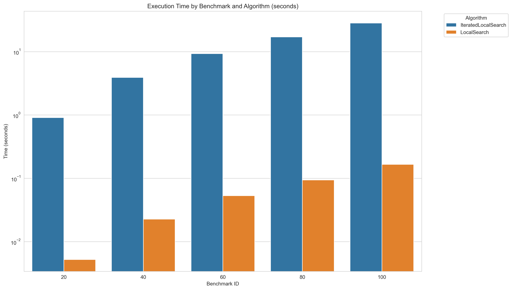

# IO-Lab4-QAP

Local search and Iterated local search for solving Quadratic Assignment Problem

# Для работы
Подтяните необходимые зависимости из файла
```
pip install -r requirements.txt
```
Для запуска бенчмарков и получения result.csv
```
python src.benchmarks
```
Для построения графиков
```
python main
```

# **Отчет**

Мы реализовали локальный и итеративный локальный поиск для решения Quadratic Assignment Problem.

Алгоритм на каждом бенчмарке запускался 200 раз, чтобы оценить среднее время и среднее качество. Iterated Local Search, в целом, справился на том же уровне, что и Local Search, при этом с большими затратами по времени, однако, если оценивать не в процентном соотношении, то достигаются достаточно значительные улучшения (особенно хорошо видно на 20, где улучшение в 2 раза)

# **Таблица:**
| benchmark_id | alg                  | benchmark | best_total_cost | avg_time_sec  | solution                                                                                                                                                                                                                           |
|--------------|----------------------|-----------|-----------------|---------------|-----------------------------------------------------------------------------------------------------------------------------------------------------------------------------------------------------------------------------------|
| 20           | IteratedLocalSearch  | tai20a    | 611072          | 0.9088935     | 2 19 18 8 1 11 16 5 4 3 13 17 7 9 14 10 15 6 0 12                                                                                                                                                                               |
| 20           | LocalSearch          | tai20a    | 687460          | 0.0052252     | 4 12 19 3 1 16 15 6 11 7 13 18 5 2 9 8 14 17 10 0                                                                                                                                                                               |
| 40           | IteratedLocalSearch  | tai40a    | 3092968         | 3.9090812     | 4 35 0 1 38 22 8 10 11 30 28 14 23 7 21 36 2 27 6 32 17 29 24 39 5 34 13 26 37 18 33 20 12 9 25 19 15 3 16 31                                                                                                                  |
| 40           | LocalSearch          | tai40a    | 3193920         | 0.0226854     | 27 29 34 0 8 35 10 14 28 17 21 3 39 31 4 13 33 15 12 25 6 1 26 20 32 7 18 19 36 2 5 24 11 16 38 23 22 37 9 30                                                                                                                  |
| 60           | IteratedLocalSearch  | tai60a    | 7114196         | 9.2824783     | 5 19 1 7 51 42 41 56 16 37 58 26 14 23 39 17 31 59 34 28 46 45 50 52 30 24 10 6 35 25 53 13 40 2 11 43 29 32 4 27 12 36 0 18 49 47 54 9 33 38 55 20 15 8 3 57 21 44 48 22                                                   |
| 60           | LocalSearch          | tai60a    | 7290372         | 0.0532723     | 17 37 13 11 46 29 54 24 33 47 8 36 43 45 52 58 44 55 28 49 27 50 2 38 1 4 48 7 22 15 5 42 53 59 19 18 3 16 30 40 51 35 34 39 6 21 12 23 56 20 57 31 32 10 41 14 0 26 9 25                                                     |
| 80           | IteratedLocalSearch  | tai80a    | 13581690        | 17.0495989    | 2 15 21 71 16 25 23 56 75 52 55 17 6 41 73 63 62 18 30 49 29 5 42 47 22 9 38 58 1 67 76 20 59 51 8 11 0 66 32 78 54 53 34 44 65 77 26 79 13 7 4 48 50 74 60 19 27 39 14 57 64 69 28 35 43 3 45 36 68 24 40 70 61 31 10 37 72 46 33 12 |
| 80           | LocalSearch          | tai80a    | 13862446        | 0.0939275     | 31 61 57 2 71 43 11 16 4 8 25 79 7 45 66 72 60 68 74 33 64 63 67 39 18 53 59 5 22 26 15 73 19 44 75 48 36 51 32 9 21 42 38 3 62 52 69 12 6 24 41 29 27 77 20 1 14 0 17 58 70 10 46 47 30 35 13 76 50 78 40 55 49 54 28 34 65 56 23 37 |
| 100          | IteratedLocalSearch  | tai100a   | 21322832        | 28.2807456    | 99 17 98 85 12 37 54 45 87 95 70 38 47 92 97 30 36 94 23 90 96 27 78 84 48 52 68 59 15 67 82 20 14 72 63 8 93 4 9 71 41 19 3 61 22 40 44 51 0 53 33 7 62 80 77 73 55 60 56 6 83 88 57 28 25 76 49 66 35 89 64 11 74 34 10 1 65 58 42 69 24 75 29 32 21 79 50 2 18 46 91 81 26 86 31 5 43 13 39 16 |
| 100          | LocalSearch          | tai100a   | 21396362        | 0.1660458     | 32 91 19 25 16 46 14 66 86 21 54 1 96 74 44 62 10 26 97 92 81 95 64 76 49 34 8 70 75 18 37 13 58 38 71 20 29 69 23 78 83 67 24 63 52 28 87 85 57 50 61 90 77 94 51 2 88 89 72 84 79 65 35 80 31 36 33 55 82 98 68 59 42 4 9 47 99 22 40 15 3 12 93 53 11 6 41 30 39 56 48 7 60 5 43 45 17 73 0 27 |

# **Время работы:**



Видно, что простой Local Search отрабатывает гораздо быстрее, что очевидно - Iterated Local Search в качестве основы берет результат от Local Search, а затем делает еще несколько дополнительных итераций (у нас 200), что сказывается на времени выполнения

# **Итоговые результаты:**


Чуть выше уже было сказано, что в процентном соотношении результаты не сильно отличаются, однако в абсолютных значениях изменение около 100000. Нужно учитывать также, что с большим количеством вершин, труднее улучшить результат, так как вариантов больше.
